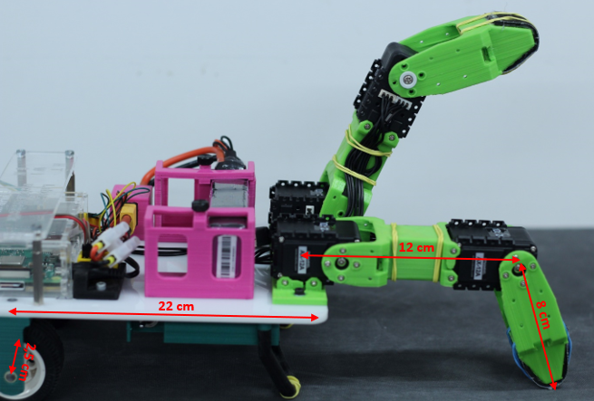

## Deep Reinforcement Learning on robot application

Implementation of the Deep Q Network for a robot to learn to walk.

Real robot

Robot simulation - learned walking by Deep Reinforcement Learning

